# Trackedify <a href="https://fahim-foysal-097.github.io/trackedify-website/"></a>

Trackedify is a lightweight personal expense tracker designed to help you take control of your finances with ease.

- Track & categorize your expenses
- Analyze your spending patterns with detailed insights
- Interactive charts & visualizations with predictions
- Create custom categories
- Simple, clean, and intuitive UI
- Works fully offline (your data stays on your device)
- Delete or edit expenses anytime
- Search expenses by category, amount, date or note
- Smart suggestions
- Swipe feature
- Built in Calculator
- Import & Export Database
- Add notes and image notes
- App Locker
- Voice Commands
- Daily Reminder
- Auto Updater
- Beautiful Insight Cards

## Screenshots

<p float="center">
    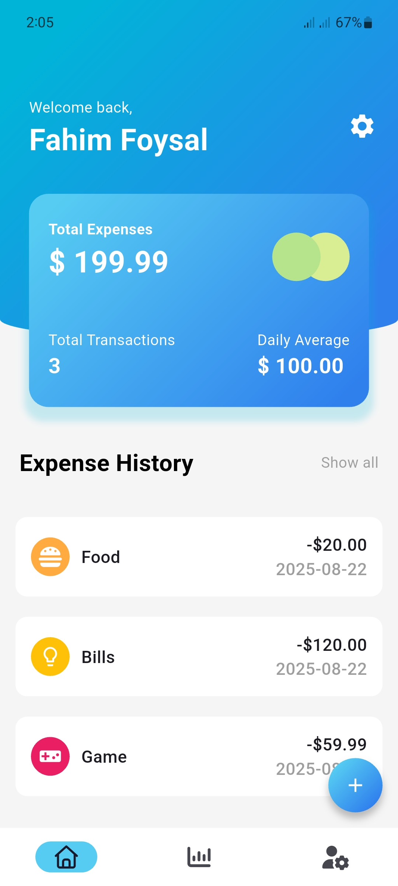
    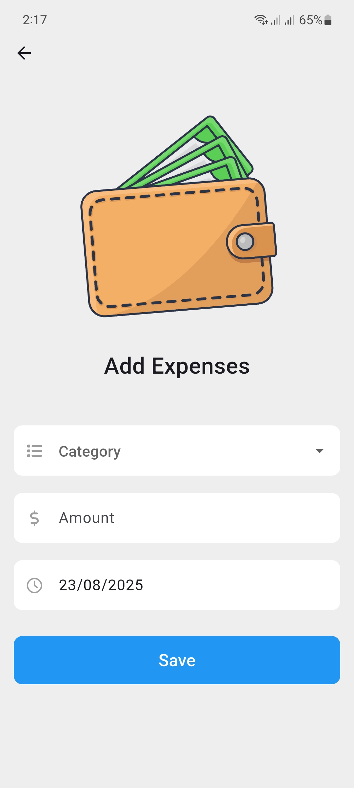
    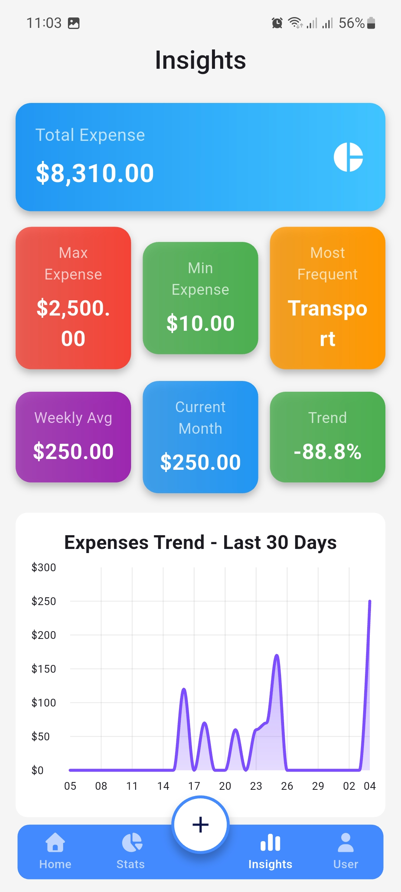
    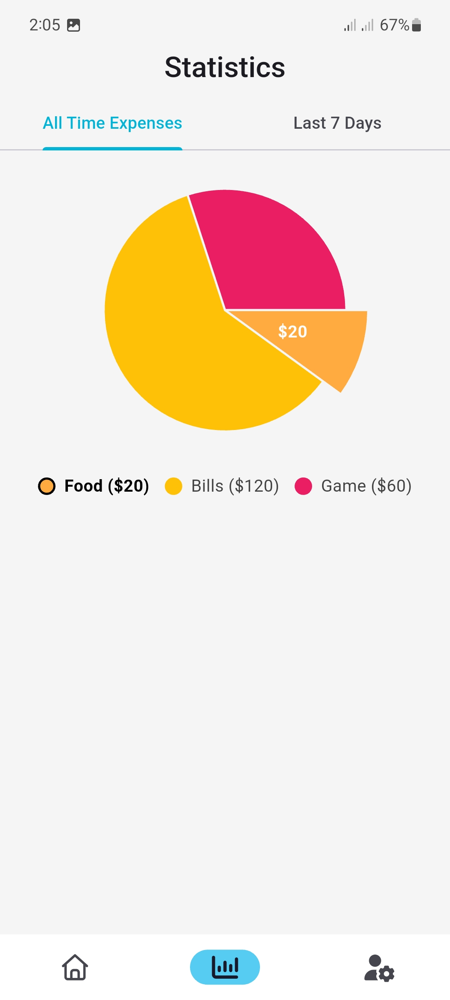
    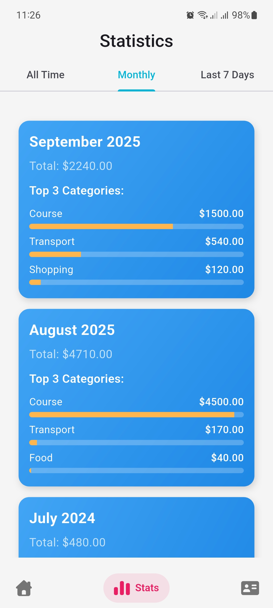
    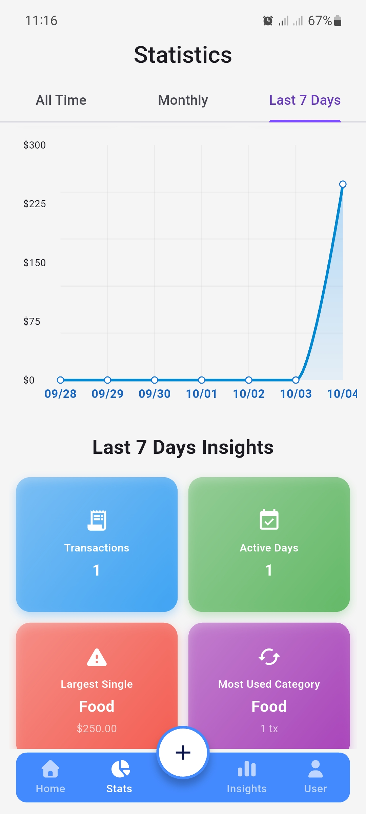
    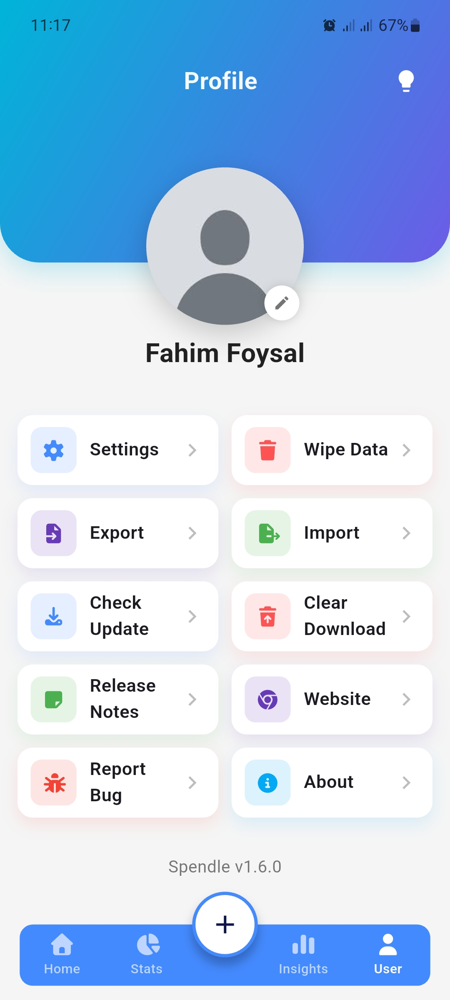
    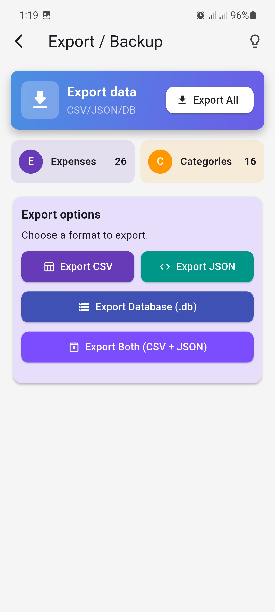
    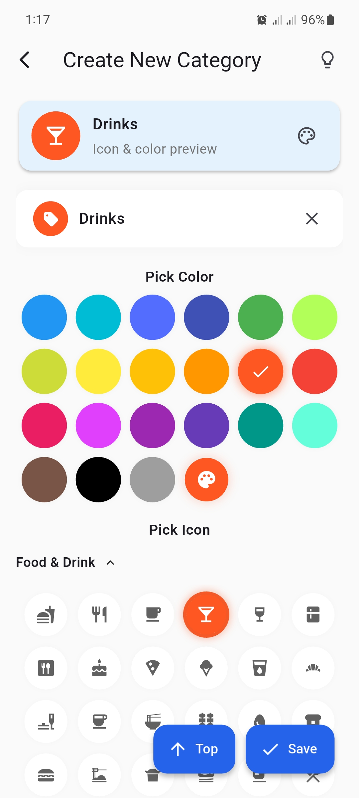
    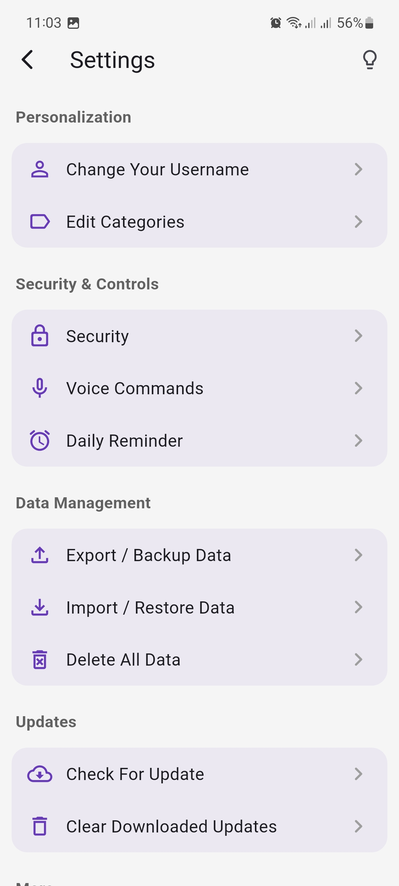
    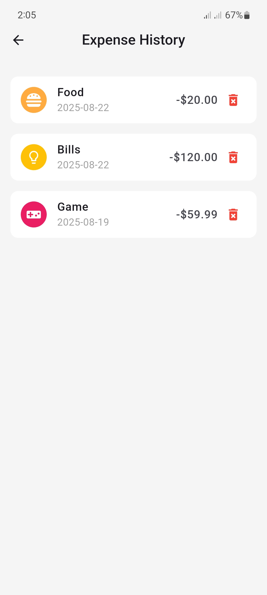
    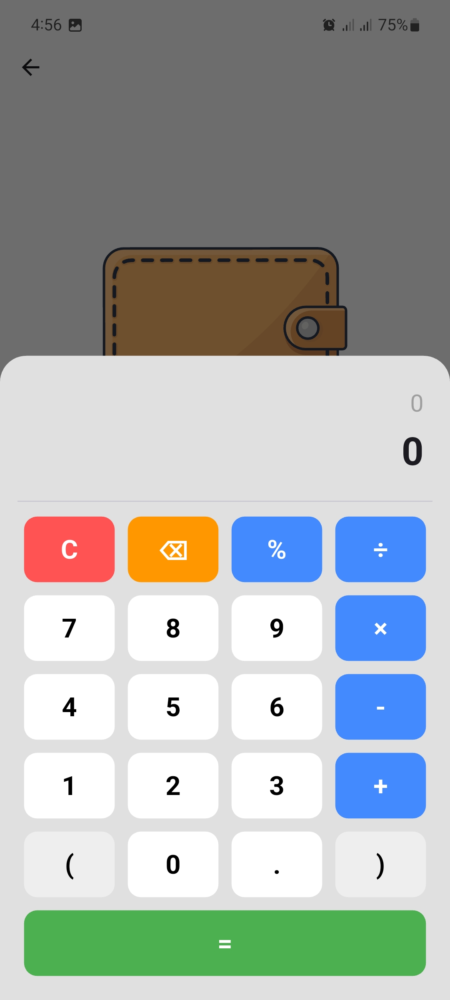
    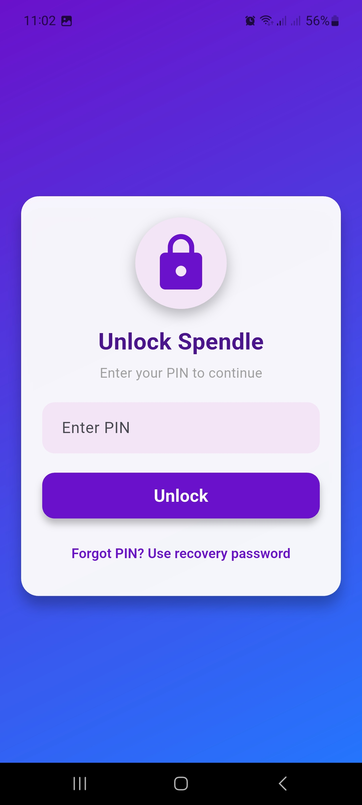
</p>

## Download

<a href="https://fahim-foysal-097.github.io/trackedify-website/"></a>

## TODO

- [x] Voice commands & App locker
- [x] Charts & Insights
- [x] Predictions
- [x] Auto updater & Notifications
- [x] Smart Suggestions (in create category)
- [x] Save images as notes
- [x] Light/Dark theme
- [ ] Predictive back gesture
- [ ] Optimization
- [ ] Make compatible with web
- [ ] Budget & Income functionality
- [ ] Smart alerts (e.g., overspending warnings)
- [ ] Cloud backup
- [ ] AI integration
- [ ] Export reports as PDF/Image

## Test/Build

### Test in debug mode

```bash
flutter run
```

### Build

first run :

```bash
flutter build apk --split-per-abi --no-tree-shake-icons
```

Then install compatible apk from build folder.

If you don't want to sign the app, then remove `signingConfigs{}` block and `signingConfig` property from `buildTypes{}` in `android/app/build.gradle.kts`

If you want to sign the app follow the flutter build tutorial -
[Learn More ](https://docs.flutter.dev/deployment/android)

#### Structure

```
Project Root
├── analysis_options.yaml
├── android
├── assets
│   ├── icons
│   ├── img
│   └── lotties
├── flutter_launcher_icons.yaml
├── ios
├── lib
│   ├── data
│   │   └── notifiers.dart
│   ├── database
│   │   ├── database_helper.dart
│   │   ├── Logic
│   │   └── models
│   ├── main.dart
│   ├── shared
│   │   ├── constants
│   │   └── widgets
│   └── views
│       ├── pages
│       ├── stats
│       └── widget_tree.dart
├── LICENSE
├── pubspec.lock
├── pubspec.yaml
├── readme_assets
├── README.md
```
