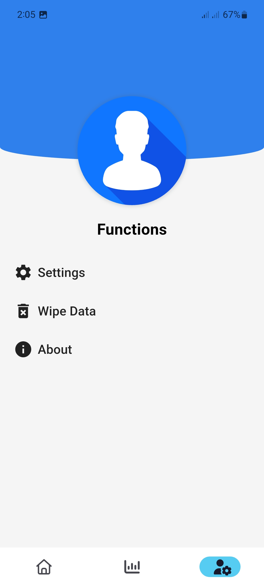

# Spendle

Spendle is a lightweight personal expense tracker designed to help you take control of your finances with ease.

## Screenshots

    
    
    
    
    
    

## Test/Build

### Test in debug mode

`flutter run`

### Build

first run :

`flutter build apk --split-per-abi`

Then install compatible apk from build forlder.

[Learn More](https://docs.flutter.dev/deployment/android)
